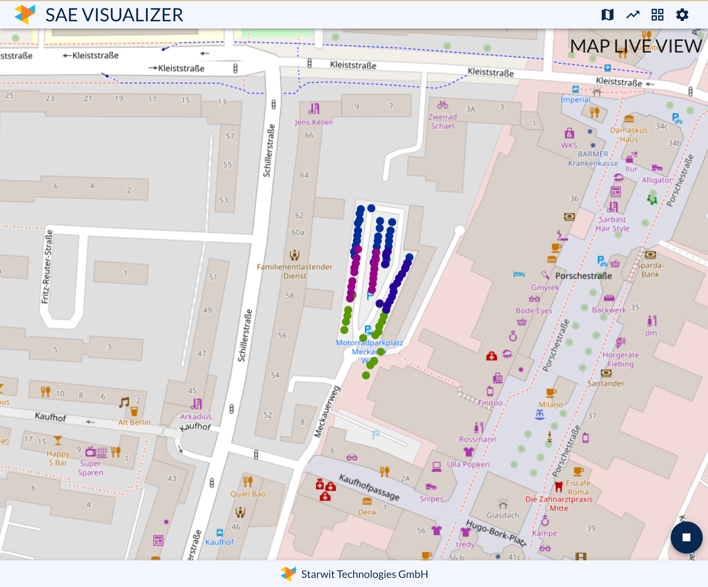
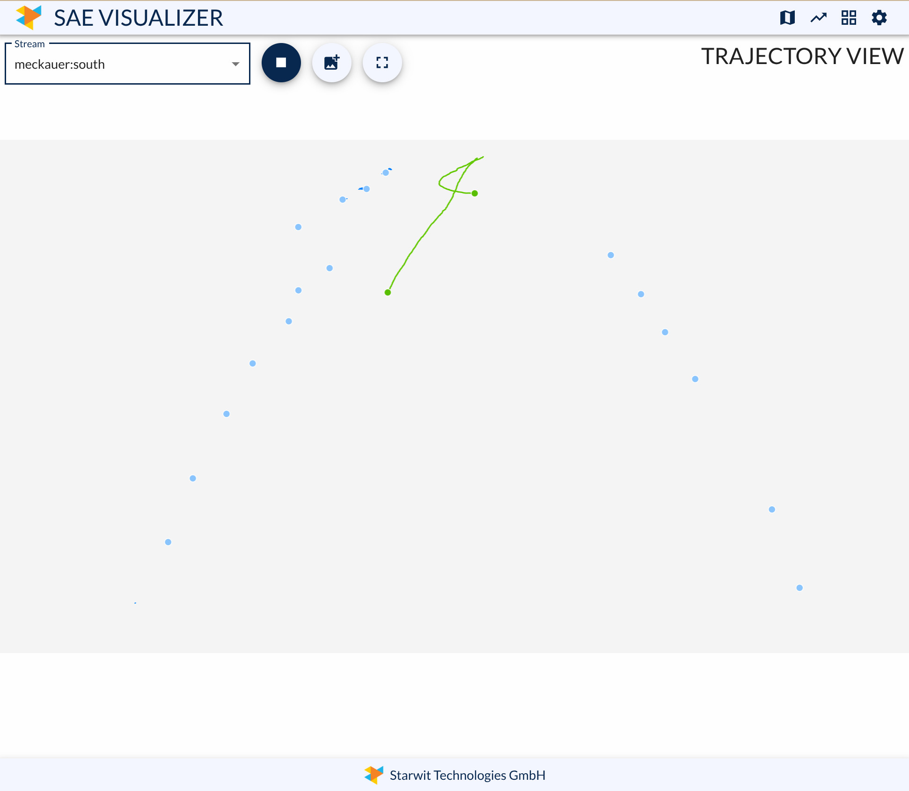

# SAE Visualizer
Starwit Awareness Engine is processing video material and extracts results likge movements of objects or geo-positions of objects. This component shall visualize these results. It is a Spring Boot app, that connects to SAE's central communication bus and sends data to a ReactJS frontend. 

Please refer to central [SAE repository](https://github.com/starwit/starwit-awareness-engine) for an overview of all SAE functions.

## What does it do
Visualizer can show moving objects in various modes. Following image show map view, which places all tracked objects on a map.



For many applications observing actual trajectories are helpful. Thus Visualizer can display trajectory sets from one or more sources. Next image show trajectories captured by one camera.



## How to use

This application needs a connection to ValKey/Redis bus of a running SAE instance. Connection details can be configured via [application.properties](application/src/main/resources/application.properties) or environment variables.

Once started application provides various views on processed data. 

## How to deploy
Application is deployed using Kubernetes with Helm. See [deployment guide](Deployment.md) for more details. If you want to run application locally you can also use [Docker compose script](deployment/docker-compose/docker-compose.yaml). Please note, that this is not intended to be used in productive scenarios.

## Development Documentation 
In order to build application, two steps are necessary. First package Javascript frontend like so:

```bash
    cd webclient/app
    npm install
```

Then Spring Boot can be build with this command:

```bash
    mvn clean install -P frontend
```

Run application locally with:

```bash
    java -jar application/target/application-xxx.jar
```

You can then access application under: http://localhost:8080/sae-visualizer

### Configuration

Application is configured via file [application.properties](application/src/main/resources/application.properties). If you create this file in root folder and run app from there, this will override packaged application.properties.

The following configuration will be used to connect to a running Valkey/Redis instance.
```properties
spring.redis.host=localhost
spring.redis.port=6379
#spring.redis.password=yourpassword
spring.redis.maxStreamAge=1s
```
- `spring.redis.maxStreamAge` is used to decide whether a stream in Valkey is active or not (and should be exposed to the frontend) based on the age of the last message in the stream
### Authentication

This application can be protected by an external authentication with Keycloak. In order to use authentication, you need a properly configured Keycloak instance and the following parameters:

```properties
#spring.profiles.active=dev # activate for no auth

# Authentication
spring.security.oauth2.client.provider.keycloak.issuer-uri=http://auth.markus-workstation-starwit/realms/aicockpit
spring.security.oauth2.client.registration.keycloak.client-id=aicockpit
spring.security.oauth2.client.registration.keycloak.client-secret=aicockpit
spring.security.oauth2.client.registration.keycloak.scope=openid
```

## License
Software in this repository is licensed under the AGPL-3.0 license. See [license agreement](LICENSE) for more details.